## Table of Contents: 
- [1.0 Problem Statement](https://github.com/arezazadeh/CapstoneProjectOnDiabetes#10-Problem-Statement)

- [1.1 Features Being Used](https://github.com/arezazadeh/CapstoneProjectOnDiabetes#11-Features-Being-Used)

- [1.2 EDA](https://github.com/arezazadeh/CapstoneProjectOnDiabetes#12-EDA)
    - [1.2.0 Correlation Matrix](https://github.com/arezazadeh/CapstoneProjectOnDiabetes#120-correlation-matrix)
    - [1.2.1 Age Analysis](https://github.com/arezazadeh/CapstoneProjectOnDiabetes#121-Age-Analysis)
    - [1.2.2 Gender Analysis](https://github.com/arezazadeh/CapstoneProjectOnDiabetes#122-Gender-Analysis)
    - [1.2.3 Hemoglobin Level Analysis](https://github.com/arezazadeh/CapstoneProjectOnDiabetes#123-Hemoglobin-A1c-HbA1c-Level)
    - [1.2.4 Blood Glucose Level Analysis](https://github.com/arezazadeh/CapstoneProjectOnDiabetes#124-Blood-Glucose-Level-Analysis)

- [1.3 Models](https://github.com/arezazadeh/CapstoneProjectOnDiabetes#13-Models)
    - [1.3.1 Models Used For Training](https://github.com/arezazadeh/CapstoneProjectOnDiabetes#131-Models-used-for-training)
    - [1.3.2 GridSearchCV ColumnTransformer and Pipeline](https://github.com/arezazadeh/CapstoneProjectOnDiabetes#132-Column-Transformers-Pipeline-and-RandomizedGridSearchCV)
    - [1.3.3 Confusion Matrix And Model Scores](https://github.com/arezazadeh/CapstoneProjectOnDiabetes#133-Confusion-Matrix-And-Score-For-The-Above-Models)
    - [1.3.4 Analysing Model Performance](https://github.com/arezazadeh/CapstoneProjectOnDiabetes#134-Analyzing-Model-Performance-Based-On-The-Confusion-Matrix)

- [1.4 Model Selection](https://github.com/arezazadeh/CapstoneProjectOnDiabetes#14-Model-Selection)
    - [1.4.1 AdaBoost Feature Importance](https://github.com/arezazadeh/CapstoneProjectOnDiabetes#141-Extracting-AdaBoost-Feature-Importance)
    - [1.4.2 Explaining the Coefficients](https://github.com/arezazadeh/CapstoneProjectOnDiabetes#142-Explaining-the-Coefficients-of-AdaBoost-Model)

- [1.5 Testing The Model](https://github.com/arezazadeh/CapstoneProjectOnDiabetes#15-Testing-The-Model-With-Test-Patient)

- [1.6 Recommendations And Next Steps](https://github.com/arezazadeh/CapstoneProjectOnDiabetes#16-Recommendations-And-Next-Steps)


    
    

## 1.0 Problem Statement

1. **You are diabetic**: This is a direct classification result when the probability of the diabetic class is above a certain threshold, often 0.5 for binary classification. However, this threshold can be adjusted based on the specific needs of the model and the business or medical requirements.

2. **You are not Diabetic**: Similarly, this is another direct classification result when the probability of the non-diabetic class is above the threshold.

3. **You have x% risk to become diabetic**: This is essentially the probability value assigned by the model to the diabetic class for the given entry. For instance, if you input a patient's data into the model and it outputs a probability of 0.65 for the "diabetic" class, it can be interpreted as "This patient has a 65% risk of becoming diabetic."

**Using Selected/Best Model with Probabilities:**

Using the model to predict class probabilities using the `predict_proba` method. This will provide probabilities for each class, and in the context of a binary problem, the output will have two columns: the first column represents the probability of the "non-diabetic" class, and the second represents the probability of the "diabetic" class.


## 1.1 Features Being Used


1. **gender**: 
    - Represents the biological sex of the individual.
    - Typically categorized as "male," "female," or in some datasets, "other" or "non-binary."

2. **age**: 
    - Represents the age of the individual, usually measured in years.
    - Can be a continuous variable (e.g., 25.5 years) or discrete (e.g., 25 years).

3. **hypertension**: 
    - Indicates whether the individual has hypertension (high blood pressure).
    - It's usually a binary indicator: "yes" (or 1) for those with hypertension, and "no" (or 0) for those without.

4. **heart_disease**: 
    - Indicates whether the individual has any heart-related diseases.
    - Typically a binary feature: "yes" (or 1) for those with heart disease and "no" (or 0) for those without.

5. **smoking_history**: 
    - Describes the individual's history with smoking.
    - Can be categorical, with values such as "never smoked," "formerly smoked," "currently smoking," etc.

6. **bmi**: 
    - Stands for "Body Mass Index."
    - A measure used to determine whether a person has a healthy body weight for their height.
    - Calculated as weight in kilograms divided by the square of height in meters. 
    - Used as an indicator of underweight, normal weight, overweight, or obesity.

7. **HbA1c_level**: 
    - Refers to the Hemoglobin A1c test.
    - Measures the average blood sugar (glucose) level over the past 2-3 months.
    - Used to diagnose diabetes and gauge how well someone is managing their diabetes.
    - Values are often presented as a percentage. A higher percentage can indicate higher blood glucose levels.

8. **blood_glucose_level**: 
    - Represents the concentration of glucose present in the blood.
    - Measured in milligrams per deciliter (mg/dL) or millimoles per liter (mmol/L).
    - A key indicator for diagnosing and monitoring diabetes.

Each of these features provides valuable health-related information. In the context of predicting or understanding diabetes, they are all relevant as they are associated with risk factors or direct indicators of diabetes.


## 1.2 EDA

### 1.2.0 Correlation Matrix 

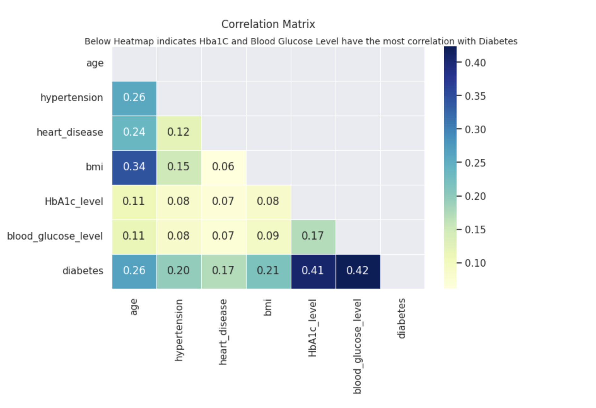


Here's what we can infer from the correlation matrix:

 #### Age
- **Moderate positive correlation with BMI (0.34)**: As age increases, BMI also tends to increase.
- **Low positive correlations with hypertension (0.26), heart disease (0.24), and diabetes (0.26)**: Older people are more likely to have these conditions, but the correlation isn't strong.
  
#### Hypertension
- **Low positive correlations with age (0.26), diabetes (0.20), and BMI (0.15)**: People with hypertension are slightly more likely to be older, diabetic, and have a higher BMI.
  
#### Heart Diseas
- **Low positive correlations with age (0.24) and diabetes (0.17)**: Older individuals and those with diabetes are slightly more likely to have heart disease.
  
#### BMI
- **Moderate positive correlation with age (0.34) and low positive correlation with diabetes (0.21)**: Higher BMI is more common in older individuals with diabetes.
  
#### HbA1c Level
- **Moderate positive correlation with diabetes (0.41)**: Higher levels of HbA1c are strongly associated with diabetes.
- **Low positive correlation with blood glucose level (0.17)**: Higher levels of HbA1c are somewhat associated with higher blood glucose levels.
  
#### Blood Glucose Level
- **Moderate positive correlation with diabetes (0.42)**: Higher blood glucose levels are strongly associated with diabetes.
- **Low positive correlation with HbA1c level (0.17)**: Higher blood glucose levels are somewhat associated with higher HbA1c levels.
  
#### Diabetes
- **Moderate positive correlation with HbA1c level (0.41) and blood glucose level (0.42)**: People with diabetes are likely to have higher levels of HbA1c and blood glucose.

To summarize, the strongest correlations we have are between diabetes and HbA1c levels, and between diabetes and blood glucose levels. These could be key features if we are looking to predict or understand diabetes in this dataset. Age and BMI also show moderate positive correlations with diabetes.


### 1.2.1 Age Analysis

```python
count    96146.000000
mean        41.794326
std         22.462948
min          0.080000
25%         24.000000
50%         43.000000
75%         59.000000
max         80.000000
Name: age, dtype: float64
```

The average age across all the entries is approximately 41.79 years.

3. **std**: The standard deviation, which is a measure of the amount of variation or dispersion in the set of values, is approximately 22.46 years. This suggests that most of the ages lie within 22.46 years above or below the mean age (41.79 years).

4. **min**: The youngest age in the dataset is 0.08 years, which is a baby of about a month old (around 29 days).

5. **25% (First Quartile)**: 25% of the people in the dataset are younger than 24 years. This is the age below which a quarter of the data falls.

6. **50% (Median)**: The median age, or the age at which half of the data points are above and half are below, is 43 years.

7. **75% (Third Quartile)**: 75% of the people in the dataset are younger than 59 years. This means that three-quarters of the data falls below this age, and one-quarter of the data is above it.

8. **max**: The oldest age in the dataset is 80 years.


* **Age with Diabetes** 


### 1.2.2 Gender Analysis

* Count of Male And Female in the Dataset
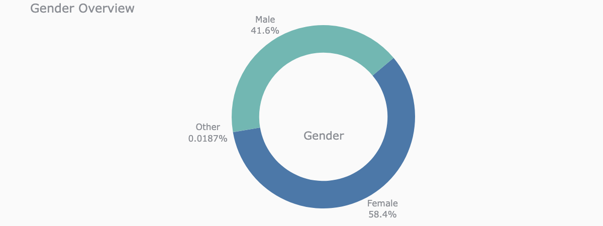

* Gender Analysis For Both Diabetes and Non-Diabetes 
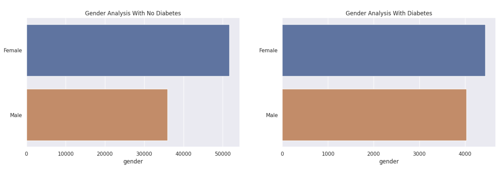

### 1.2.3 Hemoglobin A1c (HbA1c) Level 

* **HbA1c Level Density Plot**
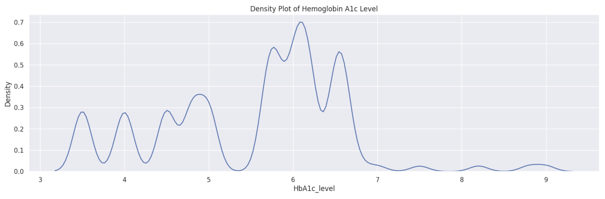

* **Statistical Testing For HbA1c Level For Both Diabetes And Non-Diabetes** 

    ```python
    --------------------------------------------------
    t-statistic: 137.92
    p-value: 0.0
    Confidence interval: [1.51, 1.56]
    --------------------------------------------------
    ```
    The results suggest a very strong statistical difference between the two groups:

    - **t-statistic**: The t-statistic of approximately 138.28 is very high, which suggests a large difference in the means of the two groups relative to the variability within the groups.

    - **p-value**: A p-value of 0.0 is indicative of the results being extremely statistically significant. This means  that the likelihood of observing such extreme differences in "HbA1c_level" between the two groups (one with  "diabetes" equal to 1 and the other with "diabetes" equal to 0) purely by chance is virtually zero.

    Given these results, we would reject the null hypothesis, which assumes that there's no difference between the two groups. This indicates that there is a statistically significant difference in "HbA1c_level" between the group with  "diabetes" equal to 1 and the group with "diabetes" equal to 0.

    The confidence interval we've calculated suggests that if the underlying population from which samples are drawn were subject to many additional samples, approximately 95% of those calculated intervals would contain the true difference in means between the two populations.

    The 95% confidence interval for the difference in mean HbA1c levels between the two groups (one with diabetes and one without) is \([1.5145, 1.5619]\).

    What this means is that we can be 95% confident that the true difference in average HbA1c levels between people with diabetes and people without diabetes in the overall population will fall within this range.

    Given the p-value of \(0.0\) in our t-test and this confidence interval that doesn't contain zero, it's safe to say that the difference in means is statistically significant. Therefore, we have strong evidence to conclude that the  average HbA1c levels are indeed different between the two groups.

* **Pie Chart For HbA1c Level vs. Diabetes and Non-Diabetes**

    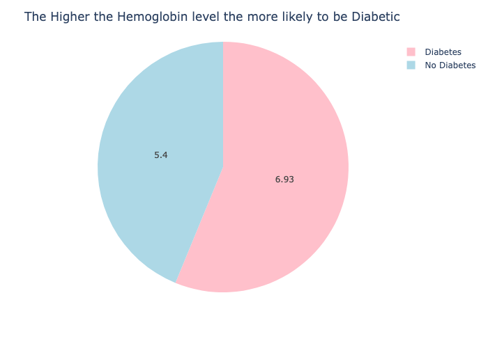

### 1.2.4 Blood Glucose Level Analysis 
* Blood Glucose Level Density Plot 
    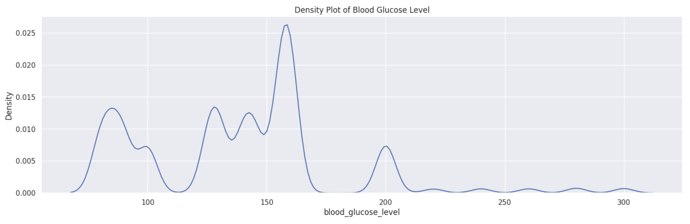

* **Statistical Testing for Blood Glucose Level**
    ```python 
    --------------------------------------------------
    t-statistic: 145.3
    p-value: 0.0
    Confidence interval: [59.94, 62.48]
    --------------------------------------------------
    ```
    **Testing whether the mean blood glucose level differs between people with diabetes (`bg_diabetes`)     and those without diabetes (`bg_no_diabetes`).**

    ### t-statistic:

    The t-statistic is a measure of how many standard errors the sample means of the two groups are     apart. A larger absolute value of the t-statistic indicates that the difference between the means is    more significant.

    - **t-statistic: 146.16**: The t-statistic is very high, indicating that the means of blood glucose     levels in the two groups are significantly different from each other.

    ### p-value:

    The p-value is a measure of the evidence against the null hypothesis, indicating there's no difference between the two groups.

    - **p-value: 0.0**: A p-value of 0.0 means that the likelihood of observing such extreme differences    between the groups under the assumption that they are the same (the null hypothesis) is virtually  zero. 

    ### Summary:

    Given the high t-statistic and the p-value of nearly zero, we can confidently reject the null   hypothesis. This means that there is a statistically significant difference in the mean blood     glucose levels between people with diabetes and those without diabetes in the dataset.

* **Pie Chart For Blood Glucose Level vs. Diabetes and Non-Diabetes**

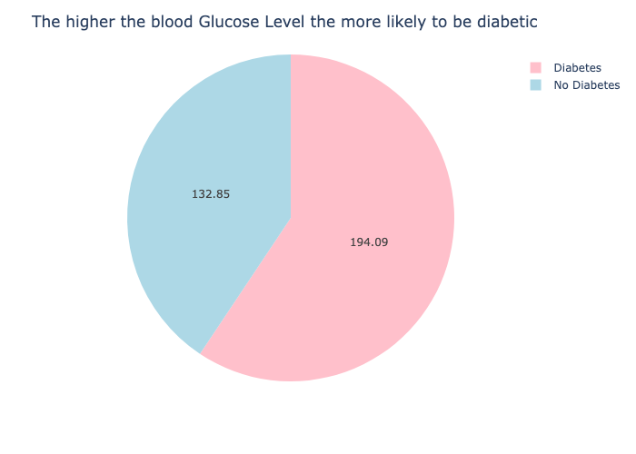

## 1.3 Models 

### 1.3.1 Models used for training

    1. LogisticRegression
    2. DecisionTreeClassifier
    3. RandomForest*
    4. XGBoost
    5. AdaBoost
    6. GradianBoost
    7. GaussianNB

### 1.3.2 Column Transformers, Pipeline and RandomizedGridSearchCV

* Standardizing the `"age", "bmi", "HbA1c_level", "blood_glucose_level"`
* Applying PolynomialFeatures to the Standardized Columns 
* Applying OneHotEncoding to `"gender"` and `"smoking_history"`
* Since this dataset is highly imbalaced, Using `SMOTE` technique to create a balanced class on training dataset (This technique   will increase the number of minority classes)
* Applying above to RandomizedGridSearchCV with 5 Cross Validation and `recall` Scoring 


### 1.3.3 Confusion Matrix And Score For The Above Models

* **Confusion Matrix**
    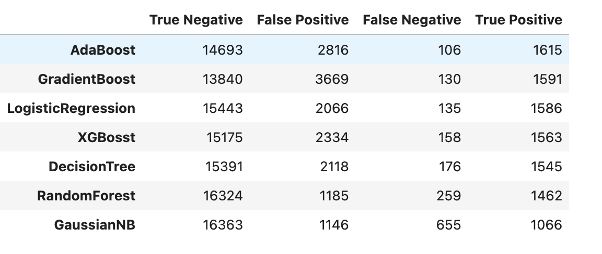

* **Models Score on Train and Test**
    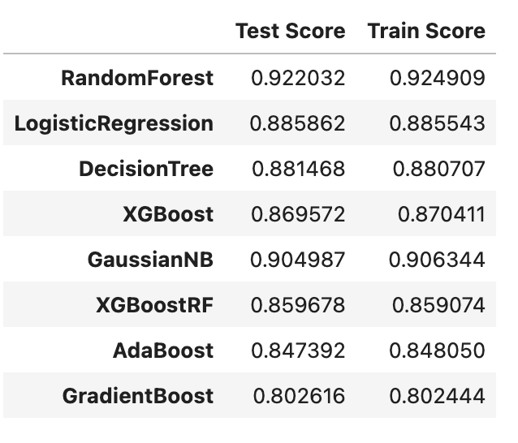


### 1.3.4 Analyzing Model Performance Based On The Confusion Matrix

1. **RandomForest** and **GaussianNB** have the highest number of True Negatives (16324 and 16363 respectively), indicating that they are good at identifying the negative class. However, RandomForest has a lower number of False Negatives and more True Positives compared to GaussianNB.

2. **LogisticRegression** and **DecisionTree** have balanced performance with a lower number of False Positives (2066 and 2118, respectively) compared to other models like AdaBoost and GradientBoost.

3. **AdaBoost** and **GradientBoost** have a higher number of False Positives (2816 and 3669, respectively), meaning they are more likely to misclassify negative instances as positive.

4. **GaussianNB** has a significantly higher number of False Negatives (655), meaning it's not as effective at capturing positive instances as the other models.

#### Sensitivity (Recall):

- If identifying True Positives is critical, then **AdaBoost** and **GradientBoost** do the best job, as they have the highest numbers of True Positives (1615 and 1591).

#### Specificity:

- If avoiding False Positives is important, then **RandomForest** and **GaussianNB** are your best bet, with RandomForest slightly edging out due to a lower number of False Positives (1185 vs 1146).

#### Balanced Performance:

- **LogisticRegression** seems to provide a more balanced performance, with a high number of True Negatives and a comparatively lower number of False Positives.

#### Error Rates:

- **GradientBoost** has the highest number of False Positives (3669), making it more prone to Type I errors.
- **GaussianNB** has the highest number of False Negatives (655), making it more prone to Type II errors.

Note: This is a simplistic analysis. It's often good to look at other metrics like F1 Score, ROC AUC, and precision-recall curves for a more complete picture.


#### Reducing False Negative
In a medical context like diabetes diagnosis, reducing False Negatives (FN) is crucial because a FN means that a patient who actually has diabetes is wrongly classified as not having it, which could lead to a lack of treatment and severe health risks. Below are the model's performance in minimizing FN:

#### False Negatives (Lower is Better):
1. **AdaBoost**: 106
2. **LogisticRegression**: 135
3. **GradientBoost**: 130
4. **XGBoost**: 158
5. **DecisionTree**: 176
6. **RandomForest**: 259
7. **GaussianNB**: 655

**AdaBoost** has the lowest number of False Negatives (106), followed closely by **LogisticRegression** and **GradientBoost**. This makes these models the most suitable for minimizing the risk of missing actual positive cases of diabetes.

#### Trade-offs:

1. **AdaBoost**: Even though it has the lowest FN, it has a higher number of False Positives (2816). Depending on the application, the cost of FP might be worth the gain in reducing FN.

2. **RandomForest** and **GaussianNB**: They have excellent True Negative counts but are the worst performers in terms of FN. For a medical application, these might not be the best choices.

3. **LogisticRegression**: Provides a balanced performance but still has room for improvement in reducing FN.


## 1.4 Model Selection

based on the analysis done above, and the number of False Negatives, I have decided to select `AdaBoost` as my best model for prediction 

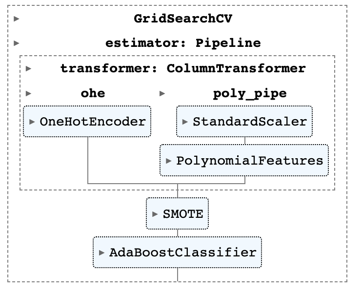

### 1.4.1 Extracting AdaBoost Feature Importance

features below were selected by AdaBoost as important

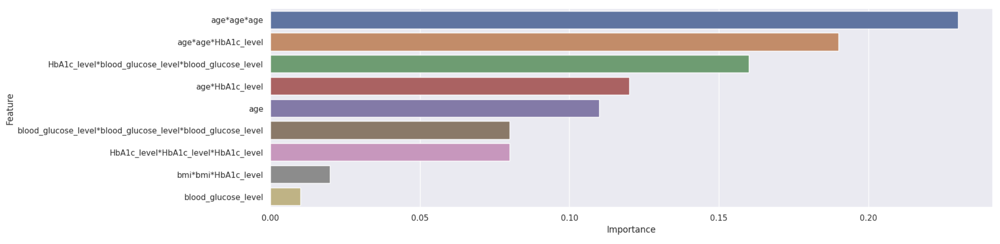

### 1.4.2 Explaining the Coefficients of AdaBoost Model

1. **`age*age*age` (0.23)**: This is the cubic term for age. It has the highest importance score of 0.23, indicating it is the most influential factor according to this AdaBoost model. A high score suggests that as the age varies, it has a considerable impact on the model's decision-making process.

2. **`age*age*HbA1c_level` (0.19)**: This is an interaction term between the square of age and the HbA1c level. The high importance score of 0.19 suggests that the interaction between these features is significantly associated with the target outcome.

3. **`HbA1c_level*blood_glucose_level*blood_glucose_level` (0.16)**: This term shows interaction between the HbA1c level and the square of blood glucose level. With a score of 0.16, it's also considered an important factor in the model's predictions.

4. **`age*HbA1c_level` (0.12)**: This is an interaction term between age and the HbA1c level. It signifies that the relationship between these two variables is important for the model's decision-making, but less so compared to the higher-ranking features.

5. **`age` (0.11)**: This is the age feature, with a score of 0.11, which indicates that age alone is also an important factor for the model.

6. **`blood_glucose_level*blood_glucose_level*blood_glucose_level` (0.08)**: This is the cubic term for blood glucose level. It has a moderate importance score of 0.08, suggesting that it still has some influence on the model's outcome.

7. **`HbA1c_level*HbA1c_level*HbA1c_level` (0.08)**: This is the cubic term for HbA1c level, also with a score of 0.08, which shows that it plays a role in the model's prediction but is not as crucial as some other features.

8. **`bmi*bmi*HbA1c_level` (0.02)**: This is an interaction term between the square of BMI and HbA1c level. With a lower importance score of 0.02, it has a comparatively minor impact on the model's decision.

9. **`blood_glucose_level` (0.01)**: This is the blood glucose level, and its very low score of 0.01 suggests that it doesn't contribute much to the model's prediction when considered alone.


## 1.5 Testing The Model With Test Patient 

Useing `predict_proba()` to determine the percentage of the patient being in Diabetes class or not

```python
test_patient = pd.DataFrame(columns=[
    "gender", 
    "age",
    "hypertension",
    "heart_disease",
    "smoking_history",
    "bmi",
    "HbA1c_level",
    "blood_glucose_level"
], index=[0])

test_patient["gender"] = "Male"
test_patient["hypertension"] = 1
test_patient["heart_disease"] = 0
test_patient["age"] = 40
test_patient["blood_glucose_level"] = 140
test_patient["HbA1c_level"] = 6
test_patient["bmi"] = 67
test_patient["smoking_history"] = "never"

ada_preds = ada_model.predict_proba(test_patient)


# Probability that the entry belongs to the diabetic class
risk_percentage = ada_preds[0][1] * 100

# Interpretation
if risk_percentage == 0:
    print("You Are Not Diabetic.\n\n")
    
elif risk_percentage == 100:
    print("You Are Diabetic.\n\n")
    
elif 100 > risk_percentage > 50:
    print(f"You have a high risk of {risk_percentage:.2f}% of becoming diabetic.\n\n")
    
elif 50 > risk_percentage > 0:
    print(f"You have a low risk of {risk_percentage:.2f}% of becoming diabetic.\n\n")
```

<p style="font-size:15px"><code>You have a low risk of 39.79% of becoming diabetic.</code></p>

## 1.6 Recommendations And Next Steps:

1. **Fine-Tuning**: For the models with the lowest FN, like AdaBoost, we could consider fine-tuning hyperparameters to see if we can reduce FN even more without significantly affecting other metrics.
   
2. **Cost-Sensitive Learning**: Implement cost-sensitive learning where the misclassification cost for FN is higher than for FP.

3. **Ensemble Methods**: Combining predictions from models that have low FN could potentially result in an even lower overall FN.

4. **Class Weighting or Resampling**: Given the importance of correctly identifying positive cases, using techniques like class weighting or oversampling the positive class could also be helpful.

5. **Additional Features or Data**: Sometimes additional information can help the model better separate the classes.

Remember that in medical contexts, it's not only about the model's statistical performance but also about how clinicians will use this information. Therefore, domain expertise is crucial in interpreting these results.